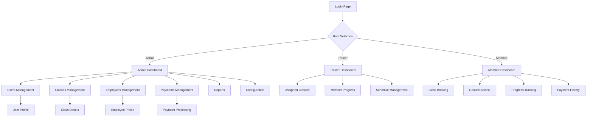

# Frontend-Backend Integration Plan

## 1. Product Overview

This document outlines the comprehensive plan for connecting all frontend functionalities, features, and UI components with their respective backend counterparts in the gym management system. The system includes user management, class scheduling, exercise tracking, payment processing, employee management, and reporting capabilities.

## 2. Core Features

### 2.1 User Roles

| Role | Registration Method | Core Permissions |
|------|---------------------|------------------|
| Admin/Owner | Direct login with admin credentials | Full system access, user management, reports |
| Trainer/Employee | Staff login with employee credentials | Class management, member tracking, limited reports |
| Member | User registration/admin creation | Personal profile, class booking, routine access |

### 2.2 Feature Module

Our gym management system consists of the following main pages that need backend integration:

1. **Login Page**: Authentication forms, role selection, credential validation
2. **Dashboard Page**: Statistics widgets, recent activities, quick actions
3. **Users Page**: Member management, profile editing, membership status
4. **Classes Page**: Class scheduling, booking management, attendance tracking
5. **Exercises Page**: Exercise library, routine creation, progress tracking
6. **Employees Page**: Staff management, schedules, performance tracking
7. **Payments Page**: Payment processing, billing history, membership renewals
8. **Routines Page**: Workout plans, assignment management, progress monitoring
9. **Reports Page**: Analytics, financial reports, member statistics
10. **Configuration Page**: System settings, preferences, integrations
11. **Community Page**: Social features, member interactions, announcements

### 2.3 Page Details

| Page Name | Module Name | Feature Description |
|-----------|-------------|--------------------|
| Login Page | Authentication Form | Validate credentials, role-based login, session management |
| Login Page | Role Selection | Choose between owner, trainer, member access levels |
| Dashboard Page | Statistics Cards | Display member count, revenue, active classes, attendance rates |
| Dashboard Page | Recent Activities | Show latest registrations, payments, class bookings |
| Dashboard Page | Quick Actions | Direct access to common tasks like adding members, creating classes |
| Users Page | Member List | Paginated user display with search, filter, and sorting |
| Users Page | User Profile Management | Create, edit, delete member profiles and memberships |
| Users Page | Membership Status | Track active/inactive memberships, renewal dates |
| Classes Page | Class Schedule | Calendar view of classes with time slots and availability |
| Classes Page | Class Management | Create, edit, cancel classes with instructor assignment |
| Classes Page | Booking System | Member class reservations, waitlist management |
| Classes Page | Attendance Tracking | Check-in/check-out functionality, attendance reports |
| Exercises Page | Exercise Library | Browse, search, filter exercises by category and muscle group |
| Exercises Page | Exercise Management | Add, edit, delete exercises with media and instructions |
| Exercises Page | Routine Builder | Create custom workout routines from exercise library |
| Employees Page | Staff Directory | Employee profiles, contact information, roles |
| Employees Page | Schedule Management | Work shifts, time tracking, availability |
| Employees Page | Performance Tracking | Reviews, certifications, payroll information |
| Payments Page | Payment Processing | Handle membership fees, class payments, product sales |
| Payments Page | Billing History | Transaction records, payment status, refunds |
| Payments Page | Financial Reports | Revenue tracking, payment analytics, overdue accounts |
| Routines Page | Routine Library | Pre-built workout plans, difficulty levels, goals |
| Routines Page | Assignment System | Assign routines to members, track progress |
| Routines Page | Progress Monitoring | Workout completion, performance metrics, achievements |
| Reports Page | Analytics Dashboard | Member statistics, revenue reports, class popularity |
| Reports Page | Export Functionality | Generate PDF/Excel reports for various metrics |
| Configuration Page | System Settings | Gym information, operating hours, pricing tiers |
| Configuration Page | Integration Management | Third-party services, payment gateways, notifications |
| Community Page | Social Feed | Member posts, achievements, gym announcements |
| Community Page | Communication Tools | Messaging, notifications, event announcements |

## 3. Core Process

### Admin/Owner Flow
1. Login with admin credentials → Dashboard overview → Manage users/classes/employees → View reports → Configure system settings

### Trainer/Employee Flow
1. Login with staff credentials → Dashboard view → Manage assigned classes → Track member progress → Update schedules

### Member Flow
1. Login/Register → View dashboard → Book classes → Access routines → Track progress → Make payments

## 4. User Interface Design

### 4.1 Design Style
- **Primary Colors**: Blue (#3B82F6), Indigo (#6366F1)
- **Secondary Colors**: Gray (#6B7280), Green (#10B981) for success states
- **Button Style**: Rounded corners (rounded-md), solid and outline variants
- **Font**: System fonts with text-sm (14px) base size
- **Layout Style**: Card-based design with sidebar navigation
- **Icons**: Lucide React icons for consistency

### 4.2 Page Design Overview

| Page Name | Module Name | UI Elements |
|-----------|-------------|-------------|
| Login Page | Authentication Form | Gradient background, centered card, role selection buttons, form inputs with validation |
| Dashboard Page | Statistics Cards | Grid layout, colored cards with icons, charts and metrics |
| Users Page | Data Table | Searchable table, pagination, action buttons, modal dialogs |
| Classes Page | Calendar View | Interactive calendar, time slots, booking status indicators |
| Exercises Page | Grid/List View | Exercise cards with images, filter sidebar, search functionality |
| Employees Page | Profile Cards | Staff cards with photos, contact info, status badges |
| Payments Page | Transaction Table | Payment history table, status badges, action buttons |
| Routines Page | Routine Cards | Workout plan cards, difficulty indicators, progress bars |
| Reports Page | Charts Dashboard | Various chart types, export buttons, date range selectors |
| Configuration Page | Settings Forms | Tabbed interface, form sections, toggle switches |
| Community Page | Social Feed | Post cards, interaction buttons, member avatars |

### 4.3 Responsiveness

The system is desktop-first with mobile-adaptive design using Tailwind CSS responsive utilities. Touch interaction optimization is implemented for mobile devices.

## 5. Integration Requirements

### 5.1 Authentication Integration
- **Frontend**: LoginPage component with role selection
- **Backend**: `/api/v1/auth/login`, `/api/v1/auth/refresh`, `/api/v1/auth/me`
- **Store**: authStore for session management
- **Status**: ✅ Partially implemented, needs role-based routing

### 5.2 User Management Integration
- **Frontend**: UsersPage with CRUD operations
- **Backend**: `/api/v1/users/*` endpoints
- **Store**: userStore for state management
- **Status**: 🔄 Needs connection

### 5.3 Class Management Integration
- **Frontend**: ClassesPage with scheduling and booking
- **Backend**: `/api/v1/classes/*` endpoints
- **Store**: classStore for state management
- **Status**: 🔄 Needs connection

### 5.4 Exercise Management Integration
- **Frontend**: ExercisesPage with library and routines
- **Backend**: `/api/v1/exercises/*` endpoints
- **Store**: exerciseStore for state management
- **Status**: 🔄 Needs connection

### 5.5 Employee Management Integration
- **Frontend**: EmployeesPage with staff management
- **Backend**: `/api/v1/employees/*` endpoints
- **Store**: employeeStore for state management
- **Status**: 🔄 Needs connection

### 5.6 Payment Processing Integration
- **Frontend**: PaymentsPage with transaction management
- **Backend**: `/api/v1/payments/*` endpoints
- **Store**: paymentStore for state management
- **Status**: 🔄 Needs connection

### 5.7 Routine Management Integration
- **Frontend**: RoutinesPage with workout plans
- **Backend**: `/api/v1/routines/*` endpoints
- **Store**: routineStore for state management
- **Status**: 🔄 Needs connection

### 5.8 Reports Integration
- **Frontend**: ReportsPage with analytics
- **Backend**: `/api/v1/reports/*` endpoints
- **Store**: dashboardStore for metrics
- **Status**: 🔄 Needs connection

### 5.9 Configuration Integration
- **Frontend**: ConfigurationPage with settings
- **Backend**: `/api/v1/config/*` endpoints
- **Store**: configStore for settings
- **Status**: 🔄 Needs connection

## 6. Implementation Priority

### Phase 1: Core Authentication & Navigation
1. Complete authentication flow with role-based routing
2. Implement protected routes and permission checks
3. Connect dashboard statistics to backend APIs

### Phase 2: User & Class Management
1. Connect user management CRUD operations
2. Implement class scheduling and booking system
3. Add real-time updates for class availability

### Phase 3: Exercise & Routine Management
1. Connect exercise library to backend
2. Implement routine creation and assignment
3. Add progress tracking functionality

### Phase 4: Employee & Payment Management
1. Connect employee management system
2. Implement payment processing
3. Add financial reporting

### Phase 5: Advanced Features
1. Connect reporting and analytics
2. Implement configuration management
3. Add community features

## 7. Technical Considerations

### 7.1 API Client Configuration
- Base URL: `http://localhost:8000` (development)
- Timeout: 30 seconds
- Retry attempts: 3
- Authentication: Bearer token

### 7.2 State Management
- Zustand stores for each feature module
- Persistent authentication state
- Optimistic updates for better UX

### 7.3 Error Handling
- Global error boundary
- API error interceptors
- User-friendly error messages
- Retry mechanisms for failed requests

### 7.4 Performance Optimization
- No lazy loading (as per requirements)
- Efficient data fetching
- Proper caching strategies
- Optimized re-renders

## 8. Testing Strategy

### 8.1 Integration Testing
- API endpoint connectivity
- Authentication flow validation
- CRUD operation verification
- Error handling scenarios

### 8.2 User Acceptance Testing
- Role-based access control
- Feature functionality validation
- UI/UX consistency
- Performance benchmarks

## 9. Deployment Considerations

### 9.1 Environment Configuration
- Development: `http://localhost:8000`
- Production: Environment-specific API URLs
- Environment variables for sensitive data

### 9.2 Build Process
- Frontend build optimization
- API endpoint configuration
- Static asset handling
- Error monitoring setup

This document serves as the comprehensive guide for connecting all frontend functionalities with their respective backend counterparts while maintaining system harmony and avoiding breaking existing functionalities.