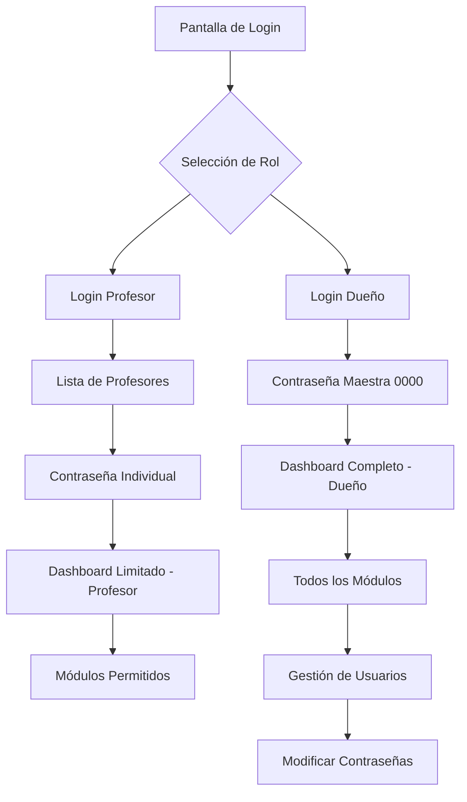

# GymSystem - Sistema de Administración para Dueños y Profesores

## 1. Descripción General del Producto

GymSystem es un sistema de administración de gimnasio enfocado exclusivamente en la gestión administrativa para Dueños y Profesores. Los miembros utilizarán una aplicación separada (member-app) en el futuro.

El sistema resuelve la administración completa del gimnasio incluyendo gestión de usuarios, rutinas, clases, empleados, pagos y configuración, dirigido específicamente a propietarios y personal del gimnasio.

Objetivo: Crear una plataforma administrativa robusta y eficiente que permita el control total del gimnasio por parte de Dueños y facilite las tareas operativas de los Profesores.

## 2. Características Principales

### 2.1 Roles de Usuario

| Rol | Método de Acceso | Permisos Principales |
|-----|------------------|---------------------|
| Dueño | Contraseña maestra global (0000) | Control total del sistema, acceso a todas las funcionalidades, gestión de usuarios y configuración |
| Profesor | Selección de lista + contraseña individual | Acceso limitado a funcionalidades operativas, gestión de clases y rutinas asignadas |

### 2.2 Módulos del Sistema

Nuestro sistema administrativo consta de las siguientes páginas principales:

1. **Login**: sistema de autenticación dual (Dueño/Profesor) con interfaz profesional de selección
2. **Dashboard**: panel de control con métricas administrativas y accesos rápidos
3. **Usuarios**: gestión completa de miembros y personal del gimnasio
4. **Rutinas**: sistema de rutinas personalizadas y plantillas
5. **Ejercicios**: biblioteca de ejercicios con gestión completa
6. **Clases**: programación y gestión de clases grupales
7. **Empleados**: gestión de personal y profesores
8. **Pagos**: sistema de facturación y control financiero
9. **Configuración**: personalización del sistema y configuración del gimnasio

### 2.3 Detalles de Páginas

| Página | Módulo | Descripción de Funcionalidad |
|--------|--------|--------------------------|
| Login | Autenticación Dueño | Acceso directo con contraseña maestra 0000, sin datos de usuario específicos |
| Login | Autenticación Profesor | Lista profesional de profesores disponibles con login individual por contraseña |
| Dashboard | Panel Administrativo | Métricas del gimnasio, estadísticas de usuarios, ingresos, clases programadas |
| Dashboard | Accesos Rápidos | Funciones frecuentes: gestión de usuarios, programación de clases, reportes |
| Usuarios | Gestión de Miembros | Crear, editar y gestionar perfiles de miembros con datos completos |
| Usuarios | Control de Contraseñas | Modificación de contraseñas de usuarios (solo para Dueño) para futura member-app |
| Usuarios | Sistema Simplificado | Gestión simplificada de credenciales para facilitar acceso de Profesores |
| Rutinas | Creación de Rutinas | Editor de rutinas personalizadas con asignación a miembros |
| Rutinas | Plantillas | Biblioteca de plantillas predefinidas por objetivos |
| Ejercicios | Biblioteca Completa | Gestión de ejercicios con categorización e instrucciones |
| Clases | Programación | Creación y gestión de horarios de clases grupales |
| Clases | Gestión de Asistencia | Control de asistencia y reservas de clases |
| Empleados | Gestión de Personal | Administración completa de empleados y profesores |
| Empleados | Roles y Permisos | Asignación de roles y configuración de accesos |
| Pagos | Facturación | Sistema de cobros, membresías y control financiero |
| Pagos | Reportes Financieros | Análisis de ingresos y estadísticas de pagos |
| Configuración | Datos del Gimnasio | Configuración del nombre del gimnasio ("Zurka" por defecto) |
| Configuración | Personalización | Configuración de marca, colores y personalización del sistema |

## 3. Proceso Principal

### Flujo de Autenticación Dueño:
1. Usuario selecciona "Dueño" en pantalla de login
2. Ingresa contraseña maestra (0000)
3. Accede al sistema con permisos completos
4. Puede gestionar todos los módulos y configuraciones

### Flujo de Autenticación Profesor:
1. Usuario selecciona "Profesor" en pantalla de login
2. Se muestra lista profesional de profesores disponibles
3. Selecciona su perfil e ingresa contraseña individual
4. Accede al sistema con permisos limitados
5. Puede gestionar clases, rutinas y funciones operativas asignadas

### Flujo de Gestión de Usuarios:
1. Dueño accede al módulo de Usuarios
2. Puede crear, editar y eliminar perfiles de miembros
3. Puede modificar contraseñas de usuarios para futura member-app
4. Gestiona datos completos de profesores con rol específico

## 4. Diseño de Interfaz de Usuario

### 4.1 Estilo de Diseño

- **Colores Primarios**: Azul profesional (#2563eb), Gris corporativo (#64748b)
- **Colores Secundarios**: Verde éxito (#10b981), Rojo alerta (#ef4444)
- **Estilo de Botones**: Redondeados con sombras sutiles, efectos hover profesionales
- **Tipografía**: Inter o similar, tamaños 14px-16px para texto, 18px-24px para títulos
- **Layout**: Diseño limpio tipo dashboard con navegación lateral, cards organizadas
- **Iconos**: Lucide React, estilo minimalista y profesional

### 4.2 Diseño de Páginas

| Página | Módulo | Elementos de UI |
|--------|--------|-----------------|
| Login | Selección de Rol | Cards elegantes para Dueño/Profesor, logo del gimnasio, fondo degradado |
| Login | Lista de Profesores | Grid profesional con fotos, nombres y especialidades, búsqueda rápida |
| Dashboard | Panel Principal | Cards con métricas, gráficos interactivos, accesos rápidos con iconos |
| Usuarios | Gestión | Tabla responsive, filtros avanzados, modales para edición, avatares |
| Configuración | Gimnasio | Formularios organizados, preview en tiempo real, configuración visual |

### 4.3 Responsividad

El sistema está optimizado para uso desktop-first con adaptación a tablets. La interfaz prioriza la eficiencia administrativa y la visualización clara de datos en pantallas grandes.

## 5. Especificaciones Técnicas

### 5.1 Arquitectura
- **Frontend**: React + TypeScript + Vite
- **Backend**: Python + FastAPI
- **Base de Datos**: PostgreSQL
- **Autenticación**: JWT simplificado para roles administrativos
- **Sin Lazy Loading**: Carga directa de todos los componentes para máximo rendimiento

### 5.2 Estructura de Roles
- **Dueño**: Acceso global sin datos de perfil específicos, solo nombre del gimnasio
- **Profesor**: Perfil completo con datos personales, especialidades y rol de profesor
- **Miembros**: Gestión desde módulo de usuarios, contraseñas para futura member-app

### 5.3 Seguridad
- Contraseña maestra para Dueño (modificable desde configuración)
- Contraseñas individuales para Profesores (modificables por Dueño)
- Sesiones seguras con JWT
- Permisos basados en roles estrictos

## 6. Configuración del Sistema

### 6.1 Configuración Inicial
- **Nombre del Gimnasio**: "Zurka" (modificable desde Configuración)
- **Contraseña Maestra**: 0000 (ver README.md para cambios)
- **Roles Predefinidos**: Dueño (global) y Profesor (individual)

### 6.2 Gestión de Contraseñas
- Dueño puede modificar contraseñas de todos los usuarios
- Sistema simplificado para facilitar gestión administrativa
- Contraseñas de miembros preparadas para futura integración con member-app

Este sistema está diseñado para ser una herramienta administrativa completa y eficiente, enfocada en las necesidades específicas de gestión de gimnasios por parte de propietarios y personal especializado.