# Sistema de Gestión de Gimnasio Modular - Nueva Versión

## 1. Descripción General del Producto

Sistema integral de gestión de gimnasio con arquitectura modular independiente, backend en Python y frontend web moderno con capacidades desktop.

El sistema resuelve la gestión completa de gimnasios incluyendo miembros, clases, entrenadores, equipos, pagos y análisis, dirigido a propietarios de gimnasios, administradores y staff.

Objetivo: Crear la plataforma más completa y personalizable del mercado con mensajería automática WhatsApp y arquitectura resiliente.

## 2. Características Principales

### 2.1 Roles de Usuario

| Rol | Método de Registro | Permisos Principales |
|-----|-------------------|---------------------|
| Super Admin | Instalación inicial | Control total del sistema, configuración global |
| Administrador | Creado por Super Admin | Gestión completa del gimnasio, reportes avanzados |
| Staff/Recepción | Invitación por Admin | Check-in/out, ventas, atención al cliente |
| Entrenador | Registro por Admin | Gestión de clases, rutinas, seguimiento de clientes |
| Miembro | Registro público/Staff | Acceso a servicios, reservas, perfil personal |

### 2.2 Módulos del Sistema

Nuestro sistema modular consta de las siguientes páginas principales:

1. **Dashboard Principal**: panel de control con métricas en tiempo real, accesos rápidos y notificaciones.
2. **Gestión de Miembros**: registro, perfiles, membresías, historial de pagos y seguimiento.
3. **Programación de Clases**: calendario, reservas, gestión de entrenadores y capacidades.
4. **Gestión de Entrenadores**: perfiles, horarios, certificaciones y evaluaciones.
5. **Control de Equipos**: inventario, mantenimiento, reservas y estado en tiempo real.
6. **Sistema de Pagos**: facturación, suscripciones, historial y recordatorios automáticos.
7. **Configuración del Sistema**: personalización, branding, usuarios y mensajería WhatsApp.

### 2.3 Detalles de Páginas

| Página | Módulo | Descripción de Funcionalidad |
|--------|--------|------------------------------|
| Dashboard Principal | Panel de Métricas | Mostrar estadísticas en tiempo real: miembros activos, ingresos del día, clases programadas, equipos en mantenimiento |
| Dashboard Principal | Accesos Rápidos | Botones para funciones frecuentes: nuevo miembro, check-in rápido, nueva clase, reporte de equipo |
| Dashboard Principal | Notificaciones | Centro de alertas: pagos vencidos, mantenimientos pendientes, clases por confirmar |
| Gestión de Miembros | Registro de Miembros | Crear perfiles completos con datos personales, contacto, foto, tipo de membresía y datos médicos básicos |
| Gestión de Miembros | Lista de Miembros | Visualizar, buscar, filtrar y gestionar todos los miembros con estados activos/inactivos |
| Gestión de Miembros | Check-in/Check-out | Sistema de entrada y salida con código QR, tarjeta o búsqueda manual |
| Gestión de Miembros | Historial de Pagos | Registro completo de transacciones, estados de pago y generación de recibos |
| Programación de Clases | Calendario de Clases | Vista mensual/semanal/diaria con todas las clases programadas y disponibilidad |
| Programación de Clases | Creación de Clases | Definir horarios, entrenador, capacidad máxima, tipo de clase y requisitos |
| Programación de Clases | Sistema de Reservas | Permitir a miembros reservar clases con lista de espera automática |
| Programación de Clases | Gestión de Asistencia | Marcar asistencia, ausencias y generar reportes de participación |
| Gestión de Entrenadores | Perfiles de Entrenadores | Información personal, certificaciones, especialidades y horarios disponibles |
| Gestión de Entrenadores | Asignación de Clases | Vincular entrenadores con clases según disponibilidad y especialidad |
| Gestión de Entrenadores | Evaluaciones | Sistema de calificación por parte de miembros y seguimiento de desempeño |
| Gestión de Entrenadores | Comisiones | Cálculo automático de pagos basado en clases impartidas y membresías vendidas |
| Control de Equipos | Inventario de Equipos | Catálogo completo con estado, ubicación, fecha de compra y valor |
| Control de Equipos | Programación de Mantenimiento | Calendario de mantenimientos preventivos y correctivos con alertas |
| Control de Equipos | Reservas de Equipos | Sistema de reserva para equipos especializados con horarios específicos |
| Control de Equipos | Reportes de Incidencias | Registro de problemas, reparaciones y historial de cada equipo |
| Sistema de Pagos | Facturación | Generar facturas automáticas por membresías, clases adicionales y servicios |
| Sistema de Pagos | Gestión de Suscripciones | Control de membresías recurrentes con renovación automática |
| Sistema de Pagos | Recordatorios de Pago | Notificaciones automáticas por WhatsApp y email antes del vencimiento |
| Sistema de Pagos | Reportes Financieros | Análisis de ingresos, gastos, proyecciones y rentabilidad |
| Configuración del Sistema | Personalización de Marca | Cambio de logo, colores, nombre del gimnasio y información de contacto |
| Configuración del Sistema | Gestión de Usuarios | Crear, editar y eliminar usuarios del sistema con roles específicos |
| Configuración del Sistema | Configuración WhatsApp | Integración con WhatsApp Web para mensajería automática |
| Configuración del Sistema | Plantillas de Mensajes | Crear y editar mensajes automáticos para diferentes eventos del sistema |

## 3. Proceso Principal

**Flujo de Administrador:**
El administrador accede al dashboard principal donde visualiza métricas en tiempo real. Puede navegar a gestión de miembros para registrar nuevos usuarios o actualizar información existente. Desde programación de clases, crea horarios y asigna entrenadores. En control de equipos, programa mantenimientos y revisa el estado del inventario. El sistema de pagos le permite generar facturas y revisar el estado financiero. Finalmente, desde configuración puede personalizar la marca y gestionar usuarios del sistema.

**Flujo de Staff/Recepción:**
El personal de recepción utiliza principalmente el check-in/check-out de miembros, puede registrar nuevos miembros y procesar pagos. Tiene acceso limitado a reportes básicos y puede gestionar reservas de clases.

**Flujo de Entrenador:**
Los entrenadores acceden a su calendario de clases, pueden marcar asistencia de miembros, crear rutinas personalizadas y actualizar el progreso de sus clientes. Tienen acceso a sus evaluaciones y pueden comunicarse con miembros a través del sistema.

**Flujo de Miembro:**
Los miembros pueden reservar clases, ver su historial de pagos, actualizar su perfil y recibir notificaciones sobre vencimientos o nuevas clases disponibles.

```mermaid
graph TD
    A[Dashboard Principal] --> B[Gestión de Miembros]
    A --> C[Programación de Clases]
    A --> D[Gestión de Entrenadores]
    A --> E[Control de Equipos]
    A --> F[Sistema de Pagos]
    A --> G[Configuración del Sistema]
    
    B --> B1[Registro de Miembros]
    B --> B2[Check-in/Check-out]
    B --> B3[Historial de Pagos]
    
    C --> C1[Calendario de Clases]
    C --> C2[Sistema de Reservas]
    C --> C3[Gestión de Asistencia]
    
    D --> D1[Perfiles de Entrenadores]
    D --> D2[Asignación de Clases]
    D --> D3[Evaluaciones]
    
    E --> E1[Inventario de Equipos]
    E --> E2[Programación de Mantenimiento]
    E --> E3[Reportes de Incidencias]
    
    F --> F1[Facturación]
    F --> F2[Gestión de Suscripciones]
    F --> F3[Reportes Financieros]
    
    G --> G1[Personalización de Marca]
    G --> G2[Configuración WhatsApp]
    G --> G3[Gestión de Usuarios]
```

## 4. Diseño de Interfaz de Usuario

### 4.1 Estilo de Diseño

- **Colores Primarios**: Azul profesional (#2563eb), Verde éxito (#16a34a), Gris neutro (#64748b)
- **Colores Secundarios**: Naranja alerta (#ea580c), Rojo error (#dc2626), Blanco (#ffffff)
- **Estilo de Botones**: Redondeados con sombras sutiles, efectos hover suaves
- **Tipografía**: Inter como fuente principal, tamaños 14px-16px para texto, 24px-32px para títulos
- **Estilo de Layout**: Diseño tipo dashboard con sidebar colapsible, cards con sombras, navegación breadcrumb
- **Iconos**: Lucide React para consistencia, estilo outline con relleno en estados activos

### 4.2 Resumen de Diseño de Páginas

| Página | Módulo | Elementos de UI |
|--------|--------|----------------|
| Dashboard Principal | Panel de Métricas | Cards con estadísticas, gráficos de línea/barras, colores de estado (verde/rojo/amarillo), animaciones suaves |
| Dashboard Principal | Accesos Rápidos | Botones grandes con iconos, grid responsivo 2x2 en móvil, 4x2 en desktop |
| Dashboard Principal | Notificaciones | Lista con badges de prioridad, scroll infinito, marcado como leído |
| Gestión de Miembros | Registro de Miembros | Formulario multi-paso, validación en tiempo real, subida de foto con preview |
| Gestión de Miembros | Lista de Miembros | Tabla con filtros avanzados, paginación, acciones rápidas (editar/ver/eliminar) |
| Gestión de Miembros | Check-in/Check-out | Scanner QR integrado, búsqueda predictiva, feedback visual de éxito |
| Programación de Clases | Calendario de Clases | Vista calendario con eventos coloridos, modal de detalles, drag & drop para reprogramar |
| Programación de Clases | Sistema de Reservas | Lista de clases disponibles, botón de reserva con confirmación, indicador de capacidad |
| Gestión de Entrenadores | Perfiles de Entrenadores | Cards de perfil con foto, rating de estrellas, badges de certificaciones |
| Control de Equipos | Inventario de Equipos | Grid de equipos con imágenes, estados con colores, filtros por categoría |
| Sistema de Pagos | Facturación | Generador de PDF integrado, preview antes de envío, plantillas personalizables |
| Configuración del Sistema | Personalización de Marca | Editor visual de temas, preview en tiempo real, subida de logo con crop |

### 4.3 Responsividad

Diseño mobile-first con adaptación completa a desktop, optimización táctil para tablets, navegación por gestos en móviles.

## 5. Arquitectura Técnica

### 5.1 Backend (Python)
- **Framework**: FastAPI para APIs REST de alto rendimiento
- **Base de Datos**: PostgreSQL con SQLAlchemy ORM
- **Autenticación**: JWT con refresh tokens
- **Cache**: Redis para sesiones y datos frecuentes
- **Mensajería**: Celery con Redis para tareas asíncronas
- **WhatsApp**: Integración con WhatsApp Web API
- **Archivos**: MinIO para almacenamiento de objetos

### 5.2 Frontend
- **Framework**: React 18 con TypeScript
- **Build**: Vite para desarrollo rápido
- **Styling**: Tailwind CSS con componentes personalizados
- **Estado**: Zustand para gestión de estado global
- **Routing**: React Router con lazy loading
- **Desktop**: Tauri para aplicación nativa
- **UI**: Shadcn/ui como base de componentes

### 5.3 Funcionalidades Avanzadas
- **Mensajería WhatsApp**: Automatización completa con plantillas personalizables
- **Personalización**: Sistema de temas dinámico con preview en tiempo real
- **Modularidad**: Cada módulo funciona independientemente con fallbacks
- **Offline**: Capacidades offline básicas con sincronización
- **Reportes**: Generación de PDF/Excel con gráficos
- **Notificaciones**: Push notifications web y desktop
- **Backup**: Sistema automático de respaldos
- **Multi-idioma**: Soporte para español e inglés

### 5.4 Integraciones
- **WhatsApp Web**: Para mensajería automática
- **Códigos QR**: Para check-in rápido
- **Cámaras**: Para fotos de perfil y documentos
- **Impresoras**: Para recibos y reportes
- **Email**: Para notificaciones y reportes
- **Calendario**: Sincronización con Google Calendar

### 5.5 Seguridad
- **Encriptación**: HTTPS obligatorio, datos sensibles encriptados
- **Autenticación**: 2FA opcional, sesiones seguras
- **Permisos**: Control granular por rol y módulo
- **Auditoría**: Log completo de acciones críticas
- **Backup**: Respaldos automáticos encriptados
- **Validación**: Sanitización de inputs, protección CSRF/XSS

Este sistema representa una evolución completa del sistema actual, manteniendo todas sus funcionalidades mientras añade capacidades modernas de personalización, mensajería automática y arquitectura resiliente.