# GymSystem - Sistema de Gestión de Gimnasio Modular Avanzado

## 1. Descripción General del Producto

GymSystem es un sistema integral de gestión de gimnasio con arquitectura modular independiente, backend en Python y frontend web moderno con capacidades desktop a través de Tauri.

El sistema resuelve la gestión completa de gimnasios incluyendo miembros, rutinas personalizadas avanzadas, clases, empleados, pagos, comunidad social y análisis en tiempo real, dirigido a administradores, dueños de gimnasios, entrenadores y miembros.

Objetivo: Crear la plataforma más completa, personalizable y resiliente del mercado con mensajería automática WhatsApp, integración con Instagram, sistema de rutinas avanzado y arquitectura que garantiza funcionamiento independiente de cada módulo.

## 2. Características Principales

### 2.1 Roles de Usuario

| Rol | Método de Registro | Permisos Principales |
|-----|-------------------|---------------------|
| Admin | Instalación inicial del sistema | Control total del sistema, configuración global, gestión de todos los usuarios y módulos |
| Dueño | Creado por Admin | Control completo del gimnasio, acceso a todos los módulos, reportes avanzados, configuración de marca |
| Entrenador | Registro por Admin/Dueño | Acceso reducido: gestión de rutinas, clases asignadas, seguimiento de miembros, comunidad |
| Miembro | Registro por Admin/Dueño/Entrenador | Acceso solo a frontend de miembro: perfil personal, rutinas asignadas, pagos, clases, comunidad (solo lectura) |

### 2.2 Módulos del Sistema

Nuestro sistema modular consta de las siguientes páginas principales:

1. **Dashboard**: panel de control unificado con +16 KPIs personalizables, +12 gráficos interactivos, métricas en tiempo real y reportes integrados.
2. **Usuarios**: gestión completa de miembros con perfiles detallados, tipos de cuota, seguimiento personalizado y sistema de check-in/out.
3. **Pagos**: sistema de facturación, gestión de cuotas por tipo, recordatorios automáticos WhatsApp y análisis financiero detallado.
4. **Rutinas**: sistema avanzado de rutinas personalizadas con plantillas inteligentes, estructuración automática, seguimiento de progreso y vinculación con ejercicios.
5. **Clases**: programación completa, sistema de reservas, gestión de horarios, seguimiento de asistencia y evaluaciones.
6. **Ejercicios**: biblioteca completa de ejercicios con categorización, instrucciones multimedia, dificultades y vinculación con rutinas.
7. **Empleados**: gestión de personal, horarios, roles, evaluaciones de desempeño y control de accesos.
8. **Comunidad**: sistema social con mensajería, integración con Instagram del gimnasio, publicaciones y interacción entre usuarios.
9. **Configuración**: personalización completa de marca (logo, nombre, colores), mensajería WhatsApp automática, configuración del sistema y plantillas.

### 2.3 Detalles de Páginas

| Página | Módulo | Descripción de Funcionalidad |
|--------|--------|------------------------------|
| Dashboard | Panel de KPIs | Mostrar +16 KPIs personalizables: usuarios activos, ingresos diarios/mensuales, clases completadas, rutinas en progreso, nuevos miembros, retención, ocupación promedio |
| Dashboard | Gráficos Interactivos | +12 gráficos configurables: tendencias de ingresos, asistencia a clases, progreso de rutinas, análisis de horarios pico, comparativas mensuales |
| Dashboard | Centro de Notificaciones | Alertas inteligentes: pagos vencidos, clases por confirmar, rutinas pendientes, mantenimientos, cumpleaños de miembros |
| Dashboard | Accesos Rápidos | Botones para funciones frecuentes: nuevo miembro, check-in rápido, nueva rutina, programar clase, enviar mensaje masivo |
| Usuarios | Gestión de Perfiles | Crear perfiles completos con datos personales, fotos, objetivos fitness, historial médico básico, tipo de cuota asignado |
| Usuarios | Tipos de Cuota | Gestión de cuotas: Mensual, Estudiante, Funcional, Semanal, Diaria, Promocional con precios y características específicas |
| Usuarios | Check-in/Check-out | Sistema de entrada con QR, búsqueda por ID/email/teléfono, registro de tiempo de permanencia, estadísticas de uso |
| Usuarios | Seguimiento de Progreso | Métricas corporales, objetivos cumplidos, evolución fotográfica, historial de rutinas completadas |
| Pagos | Gestión de Cuotas | Facturación automática según tipo de cuota, renovaciones, estados de pago, generación de recibos PDF |
| Pagos | Recordatorios Automáticos | Mensajes WhatsApp programados: vencimientos, bienvenidas, confirmaciones de pago, ofertas especiales |
| Pagos | Análisis Financiero | Reportes de ingresos, proyecciones, análisis por tipo de cuota, métricas de retención y crecimiento |
| Pagos | Historial Completo | Registro detallado de todas las transacciones con filtros avanzados y exportación |
| Rutinas | Creador de Rutinas | Editor visual avanzado con drag & drop, biblioteca de ejercicios, configuración de series/repeticiones/descansos |
| Rutinas | Sistema de Plantillas | Plantillas predefinidas por objetivos: pérdida de peso, ganancia muscular, resistencia, rehabilitación, personalizables |
| Rutinas | Estructuración Automática | IA para sugerir rutinas basadas en objetivos, nivel, tiempo disponible y equipamiento |
| Rutinas | Seguimiento de Progreso | Registro de pesos, repeticiones, tiempos, evolución gráfica, logros y metas alcanzadas |
| Rutinas | Asignación por Usuario | Vincular rutinas específicas a miembros, seguimiento personalizado, ajustes automáticos según progreso |
| Clases | Calendario Inteligente | Vista mensual/semanal/diaria con disponibilidad en tiempo real, capacidad máxima, lista de espera |
| Clases | Sistema de Reservas | Reservas online para miembros, confirmaciones automáticas, cancelaciones, penalizaciones por no asistencia |
| Clases | Gestión de Entrenadores | Asignación automática según especialidad y disponibilidad, evaluaciones de desempeño |
| Clases | Control de Asistencia | Marcar asistencia con QR, registro de ausencias, estadísticas de participación, reportes por clase |
| Ejercicios | Biblioteca Completa | Catálogo extenso con videos, imágenes, instrucciones detalladas, músculos trabajados, equipamiento necesario |
| Ejercicios | Categorización Avanzada | Filtros por grupo muscular, tipo de ejercicio, dificultad, equipamiento, objetivos específicos |
| Ejercicios | Vinculación con Rutinas | Integración directa con el creador de rutinas, sugerencias automáticas, variaciones y progresiones |
| Ejercicios | Gestión de Contenido | Subida de videos/imágenes propios, edición de descripciones, creación de ejercicios personalizados |
| Empleados | Perfiles de Personal | Información completa: datos personales, certificaciones, especialidades, horarios, salarios |
| Empleados | Control de Accesos | Permisos granulares por módulo, horarios de acceso, registro de actividades, roles personalizables |
| Empleados | Evaluaciones | Sistema de calificación por desempeño, feedback de miembros, metas y objetivos |
| Empleados | Gestión de Horarios | Turnos, disponibilidad, reemplazos, control de horas trabajadas, reportes de asistencia |
| Comunidad | Sistema de Mensajería | Envío de mensajes a todos los usuarios, segmentación por grupos, programación de envíos |
| Comunidad | Integración Instagram | Mostrar publicaciones del Instagram del gimnasio, sincronización automática, gestión de contenido |
| Comunidad | Interacción Social | Publicaciones internas, comentarios (solo staff), anuncios importantes, eventos especiales |
| Comunidad | Gestión de Contenido | Moderación de contenido, plantillas de mensajes, calendario de publicaciones |
| Configuración | Personalización de Marca | Cambio dinámico de logo, nombre del gimnasio, colores corporativos, información de contacto |
| Configuración | Configuración WhatsApp | Integración con WhatsApp Web, plantillas de mensajes automáticos, programación de envíos |
| Configuración | Gestión de Usuarios | Crear, editar, eliminar usuarios del sistema, asignación de roles, reseteo de contraseñas |
| Configuración | Configuración del Sistema | Parámetros generales, backup automático, logs de actividad, configuración de notificaciones |

## 3. Proceso Principal

**Flujo de Admin/Dueño:**
Acceso completo al dashboard con todos los KPIs y gráficos personalizables. Navegación a gestión de usuarios para registrar miembros y asignar tipos de cuota. Creación y asignación de rutinas personalizadas desde el módulo de rutinas. Programación de clases y asignación de entrenadores. Gestión completa de pagos y análisis financiero. Control total de empleados y sus permisos. Administración de la comunidad y configuración de Instagram. Personalización completa del sistema desde configuración.

**Flujo de Entrenador:**
Acceso limitado al dashboard con métricas relevantes a sus clases y miembros asignados. Gestión de rutinas para sus miembros específicos. Visualización y gestión de sus clases asignadas. Acceso a la biblioteca de ejercicios para crear rutinas. Participación en la comunidad con permisos de publicación. Actualización de su perfil y horarios.

**Flujo de Miembro (Frontend Separado):**
Acceso exclusivo a frontend de miembro con: visualización de perfil personal y progreso, rutinas asignadas con seguimiento, historial de pagos y estado de cuota, clases reservadas y disponibles, visualización de comunidad (solo lectura), integración con Instagram del gimnasio.

```mermaid
graph TD
    A[Dashboard] --> B[Usuarios]
    A --> C[Pagos]
    A --> D[Rutinas]
    A --> E[Clases]
    A --> F[Ejercicios]
    A --> G[Empleados]
    A --> H[Comunidad]
    A --> I[Configuración]
    
    B --> B1[Gestión de Perfiles]
    B --> B2[Tipos de Cuota]
    B --> B3[Check-in/Check-out]
    B --> B4[Seguimiento de Progreso]
    
    C --> C1[Gestión de Cuotas]
    C --> C2[Recordatorios WhatsApp]
    C --> C3[Análisis Financiero]
    
    D --> D1[Creador de Rutinas]
    D --> D2[Sistema de Plantillas]
    D --> D3[Estructuración Automática]
    D --> D4[Asignación por Usuario]
    
    E --> E1[Calendario Inteligente]
    E --> E2[Sistema de Reservas]
    E --> E3[Control de Asistencia]
    
    F --> F1[Biblioteca Completa]
    F --> F2[Categorización Avanzada]
    F --> F3[Vinculación con Rutinas]
    
    G --> G1[Perfiles de Personal]
    G --> G2[Control de Accesos]
    G --> G3[Evaluaciones]
    
    H --> H1[Sistema de Mensajería]
    H --> H2[Integración Instagram]
    H --> H3[Interacción Social]
    
    I --> I1[Personalización de Marca]
    I --> I2[Configuración WhatsApp]
    I --> I3[Gestión de Usuarios]
```

## 4. Diseño de Interfaz de Usuario

### 4.1 Estilo de Diseño

- **Colores Primarios**: Azul profesional (#1e40af), Verde éxito (#059669), Gris neutro (#6b7280)
- **Colores Secundarios**: Naranja alerta (#ea580c), Rojo error (#dc2626), Púrpura premium (#7c3aed), Blanco (#ffffff)
- **Estilo de Botones**: Redondeados modernos con sombras sutiles, efectos hover suaves, gradientes opcionales
- **Tipografía**: Inter como fuente principal, tamaños 14px-16px para texto, 20px-32px para títulos, peso variable
- **Estilo de Layout**: Diseño dashboard moderno con sidebar colapsible, cards con sombras elegantes, navegación breadcrumb, grid responsivo
- **Iconos**: Lucide React para consistencia, estilo outline con relleno en estados activos, animaciones micro

### 4.2 Resumen de Diseño de Páginas

| Página | Módulo | Elementos de UI |
|--------|--------|----------------|
| Dashboard | Panel de KPIs | Cards estadísticas con iconos animados, +16 KPIs configurables, colores de estado dinámicos, tooltips informativos |
| Dashboard | Gráficos Interactivos | +12 gráficos Chart.js/D3, filtros temporales, zoom, exportación, personalización de colores |
| Dashboard | Centro de Notificaciones | Lista con badges de prioridad, scroll infinito, marcado como leído, filtros por tipo |
| Usuarios | Gestión de Perfiles | Formulario multi-paso con validación, subida de foto con crop, selector de tipo de cuota, campos dinámicos |
| Usuarios | Check-in/Check-out | Scanner QR integrado, búsqueda predictiva con autocompletado, feedback visual de éxito, historial en tiempo real |
| Pagos | Gestión de Cuotas | Tabla avanzada con filtros, estados coloridos, generación PDF, modal de detalles, acciones masivas |
| Rutinas | Creador de Rutinas | Editor drag & drop visual, biblioteca de ejercicios lateral, configurador de series, preview en tiempo real |
| Rutinas | Sistema de Plantillas | Grid de plantillas con preview, filtros por objetivo, duplicación, personalización avanzada |
| Clases | Calendario Inteligente | Vista calendario con eventos coloridos, modal de detalles, drag & drop para reprogramar, indicadores de capacidad |
| Ejercicios | Biblioteca Completa | Grid con imágenes, videos integrados, filtros avanzados, búsqueda inteligente, categorías visuales |
| Empleados | Perfiles de Personal | Cards de perfil con foto, badges de certificaciones, rating visual, timeline de actividades |
| Comunidad | Integración Instagram | Feed integrado de Instagram, sincronización automática, modal de vista completa, gestión de hashtags |
| Configuración | Personalización de Marca | Editor visual de temas, preview en tiempo real, subida de logo con crop, selector de colores |

### 4.3 Responsividad

Diseño mobile-first con adaptación completa a desktop, optimización táctil para tablets, navegación por gestos en móviles, sidebar colapsible automático, grids responsivos con breakpoints personalizados.

## 5. Arquitectura Técnica

### 5.1 Backend (Python)
- **Framework**: FastAPI para APIs REST de alto rendimiento con documentación automática
- **Base de Datos**: PostgreSQL con SQLAlchemy ORM y Alembic para migraciones
- **Autenticación**: JWT con refresh tokens, login por ID/email/teléfono
- **Cache**: Redis para sesiones, datos frecuentes y cola de mensajes
- **Mensajería**: Celery con Redis para tareas asíncronas y WhatsApp
- **WhatsApp**: Integración con WhatsApp Web API para mensajería automática
- **Archivos**: Sistema de almacenamiento local con backup automático
- **Instagram**: API de Instagram Basic Display para integración

### 5.2 Frontend
- **Framework Principal**: React 18 con TypeScript para type safety
- **Build Tool**: Vite para desarrollo rápido y hot reload
- **Styling**: Tailwind CSS con componentes personalizados y temas dinámicos
- **Estado Global**: Zustand para gestión de estado ligera y eficiente
- **Routing**: React Router v6 con lazy loading y protección de rutas
- **Desktop**: Tauri para aplicación nativa multiplataforma
- **UI Components**: Shadcn/ui como base con componentes personalizados
- **Gráficos**: Chart.js/Recharts para visualizaciones interactivas
- **Formularios**: React Hook Form con validación Zod

### 5.3 Funcionalidades Avanzadas
- **Mensajería WhatsApp**: Automatización completa con plantillas personalizables por evento
- **Personalización Dinámica**: Sistema de temas en tiempo real con preview instantáneo
- **Modularidad Independiente**: Cada módulo funciona independientemente con fallbacks y error boundaries
- **Sistema de Rutinas Avanzado**: IA básica para sugerencias, plantillas inteligentes, seguimiento detallado
- **Integración Instagram**: Sincronización automática de posts, gestión de contenido
- **Reportes Avanzados**: Generación de PDF/Excel con gráficos, programación automática
- **Notificaciones Push**: Web push notifications y notificaciones desktop
- **Backup Automático**: Sistema de respaldos programados con restauración
- **Multi-idioma**: Soporte para español e inglés con cambio dinámico

### 5.4 Integraciones Específicas
- **WhatsApp Web**: Para mensajería automática programada por eventos
- **Instagram Basic Display**: Para mostrar posts del gimnasio
- **Códigos QR**: Para check-in rápido y identificación
- **Cámaras Web**: Para fotos de perfil y documentos
- **Impresoras**: Para recibos, reportes y credenciales
- **Email SMTP**: Para notificaciones y reportes por correo
- **Tauri**: Para aplicación desktop nativa

### 5.5 Seguridad Básica
- **Encriptación**: HTTPS obligatorio, contraseñas hasheadas con bcrypt
- **Autenticación**: JWT seguro con expiración, login múltiple (ID/email/teléfono)
- **Permisos**: Control granular por rol y módulo con middleware
- **Validación**: Sanitización de inputs, protección básica CSRF
- **Auditoría**: Log de acciones críticas con timestamps
- **Backup**: Respaldos automáticos con retención configurable
- **Teléfonos**: Formato automático "+54" para números argentinos

### 5.6 Características Especiales
- **Frontend Dual**: Sistema principal para Admin/Dueño/Entrenador y frontend separado para Miembros
- **Tipos de Cuota**: Sistema flexible (Mensual, Estudiante, Funcional, Semanal, etc.)
- **Dashboard Avanzado**: +16 KPIs personalizables y +12 gráficos configurables
- **Rutinas Inteligentes**: Plantillas, estructuración automática, seguimiento detallado
- **Comunidad Social**: Mensajería interna + integración Instagram
- **Personalización Total**: Logo, nombre, colores modificables desde configuración
- **Mensajería Automática**: WhatsApp programado por eventos (pagos, vencimientos, bienvenidas)

Este sistema representa una evolución completa hacia un GymSystem moderno, modular e independiente, con todas las funcionalidades solicitadas y capacidades avanzadas para la gestión integral