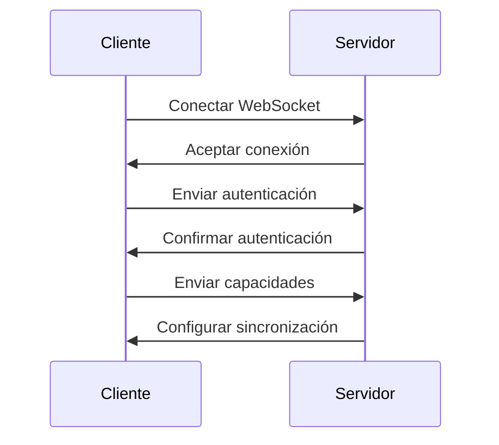
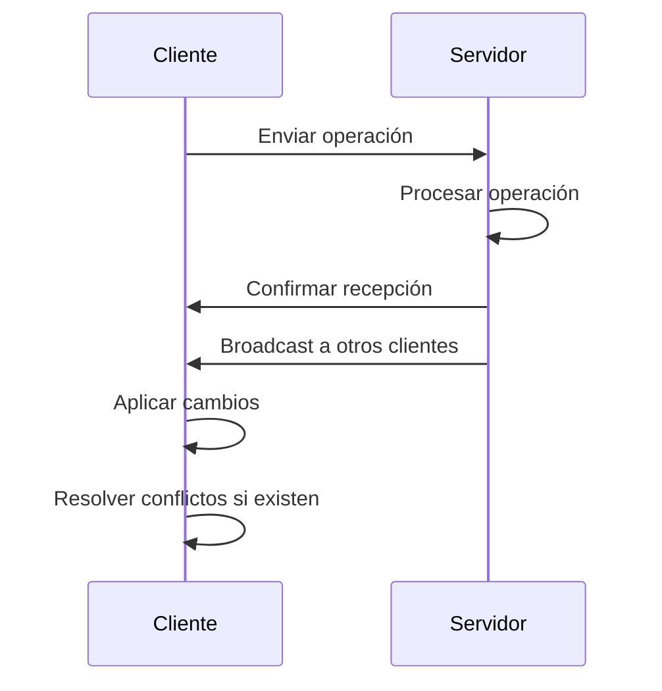
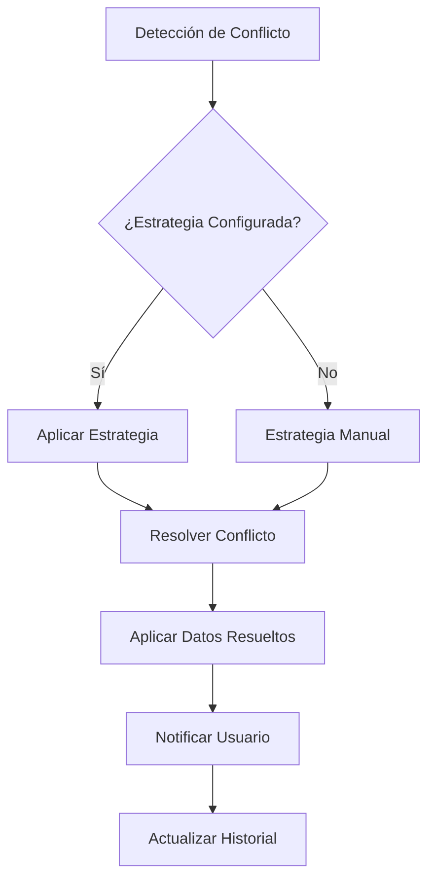

# Fase 5.1: Sincronización en Tiempo Real
## Sistema de Gestión de Gimnasio v6

### Resumen Ejecutivo

La **Fase 5.1** implementa un sistema completo de sincronización en tiempo real usando WebSockets, que permite actualizaciones instantáneas entre múltiples clientes y el servidor, con resolución automática de conflictos y optimización de rendimiento.

### Características Principales

#### 🔄 WebSockets para Actualizaciones Instantáneas
- **Conexión Persistente**: WebSocket mantenido activo con el servidor
- **Actualizaciones en Tiempo Real**: Cambios reflejados instantáneamente
- **Reconexión Automática**: Recuperación automática de conexiones perdidas
- **Autenticación Segura**: Tokens JWT para autenticación de conexiones

#### ⚖️ Conflict Resolution Avanzado
- **Detección Automática**: Identificación inteligente de conflictos
- **Estrategias Configurables**: Diferentes estrategias por tipo de tabla
- **Resolución Basada en Timestamps**: Lógica temporal para conflictos
- **Merge Inteligente**: Combinación automática de datos conflictivos

#### 🎯 Sincronización Selectiva
- **Control Granular**: Sincronización por tablas específicas
- **Optimización de Ancho de Banda**: Solo sincronizar datos necesarios
- **Configuración Flexible**: Adaptable a diferentes necesidades
- **Prioridades Configurables**: Control de qué datos sincronizar primero

#### 🗜️ Compresión de Datos en Tiempo Real
- **Compresión Automática**: Algoritmo adaptativo según tamaño de datos
- **Verificación de Integridad**: Checksums MD5 para validar datos
- **Métricas en Tiempo Real**: Estadísticas de compresión
- **Optimización de Ancho de Banda**: Reducción significativa de tráfico

#### 📊 Monitoreo de Estado de Conexión
- **Widget de Estado**: Interfaz visual del estado de sincronización
- **Indicadores Visuales**: Estados claros y comprensibles
- **Estadísticas Detalladas**: Métricas completas de rendimiento
- **Alertas Automáticas**: Notificaciones de problemas

### Arquitectura del Sistema

#### Componentes Principales

##### 1. RealtimeSyncManager (`cliente/utils/realtime_sync.py`)
```python
class RealtimeSyncManager:
    """Gestor principal de sincronización en tiempo real"""
    
    def __init__(self, api_client, config_manager):
        # Inicialización de componentes
        self.conflict_resolver = ConflictResolver()
        self.data_compressor = DataCompressor()
        self.websocket = None
        self.status = SyncStatus.DISCONNECTED
```

**Responsabilidades:**
- Gestión de conexión WebSocket
- Coordinación de sincronización
- Manejo de callbacks y eventos
- Estadísticas y monitoreo

##### 2. ConflictResolver
```python
class ConflictResolver:
    """Resolvedor avanzado de conflictos"""
    
    def __init__(self):
        self.resolution_strategies = {
            "usuarios": ConflictResolution.TIMESTAMP,
            "clases": ConflictResolution.SERVER_WINS,
            "asistencias": ConflictResolution.MERGE,
            "pagos": ConflictResolution.SERVER_WINS,
            "empleados": ConflictResolution.TIMESTAMP,
            "default": ConflictResolution.MANUAL
        }
```

**Estrategias de Resolución:**
- **SERVER_WINS**: El servidor siempre tiene prioridad
- **CLIENT_WINS**: El cliente siempre tiene prioridad
- **MERGE**: Combinación inteligente de datos
- **TIMESTAMP**: Basado en timestamps de actualización
- **MANUAL**: Requiere intervención del usuario

##### 3. DataCompressor
```python
class DataCompressor:
    """Compresor de datos en tiempo real"""
    
    def compress_data(self, data: Dict[str, Any]) -> Dict[str, Any]:
        # Comprimir datos si es beneficioso
        # Verificar ratio de compresión
        # Agregar checksum de integridad
```

**Características:**
- Compresión automática con zlib
- Verificación de integridad con checksums
- Métricas de compresión en tiempo real
- Algoritmo adaptativo según tamaño

##### 4. RealtimeStatusWidget (`cliente/widgets/realtime_status_widget.py`)
```python
class RealtimeStatusWidget(QWidget):
    """Widget de estado de sincronización en tiempo real"""
    
    def __init__(self, parent=None):
        # Configuración de UI
        # Conectar callbacks
        # Inicializar timers de actualización
```

**Funcionalidades:**
- Indicadores visuales de estado
- Estadísticas de conflictos
- Métricas de compresión
- Controles de configuración

### Flujo de Sincronización

#### 1. Establecimiento de Conexión


#### 2. Proceso de Sincronización


#### 3. Resolución de Conflictos


### Configuración y Uso

#### Configuración Inicial
```python
# En la ventana principal
def setup_realtime_sync(self):
    # Obtener gestor de sincronización
    self.realtime_sync_manager = get_realtime_sync_manager(
        self.api_client, 
        self.config
    )
    
    # Configurar sincronización selectiva
    sync_tables = ["usuarios", "clases", "asistencias", "pagos", "empleados"]
    self.realtime_sync_manager.enable_selective_sync(sync_tables)
    
    # Conectar callbacks
    self.realtime_sync_manager.add_status_callback(self._on_sync_status_changed)
    self.realtime_sync_manager.add_data_callback("*", self._on_sync_data_received)
    self.realtime_sync_manager.add_conflict_callback(self._on_sync_conflict)
```

#### Envío de Operaciones
```python
# Enviar operación de sincronización
def send_sync_operation(self, table: str, operation: str, data: dict):
    if hasattr(self, 'realtime_sync_manager'):
        self.realtime_sync_manager.send_operation(table, operation, data)
```

#### Manejo de Callbacks
```python
def _on_sync_status_changed(self, new_status, old_status):
    # Actualizar indicadores de estado
    status_text = f"Sincronización: {new_status.value}"
    self.statusBar().showMessage(status_text, 3000)

def _on_sync_data_received(self, table: str, data: dict):
    # Actualizar widgets correspondientes
    if table == "usuarios" and hasattr(self, 'usuarios_tab'):
        self.usuarios_tab.refresh_data()

def _on_sync_conflict(self, conflict_data):
    # Mostrar notificación de conflicto resuelto
    QMessageBox.information(
        self, "Conflicto de Sincronización",
        "Se ha resuelto automáticamente un conflicto."
    )
```

### Estados de Sincronización

#### SyncStatus Enum
```python
class SyncStatus(Enum):
    CONNECTED = "connected"      # Conectado y funcionando
    CONNECTING = "connecting"    # Intentando conectar
    DISCONNECTED = "disconnected" # Desconectado
    RECONNECTING = "reconnecting" # Reconectando
    SYNCING = "syncing"         # Sincronizando datos
    CONFLICT = "conflict"       # Conflicto detectado
    ERROR = "error"             # Error en sincronización
```

### Métricas y Estadísticas

#### Estadísticas de Sincronización
```python
def get_stats(self) -> Dict[str, Any]:
    return {
        "status": self.status.value,
        "operations_sent": self.sync_stats["operations_sent"],
        "operations_received": self.sync_stats["operations_received"],
        "conflicts_resolved": self.sync_stats["conflicts_resolved"],
        "connection_uptime": uptime,
        "reconnect_attempts": self.reconnect_attempts,
        "compression_stats": self.data_compressor.get_compression_stats(),
        "conflict_stats": self.conflict_resolver.get_conflict_stats()
    }
```

#### Estadísticas de Compresión
```python
def get_compression_stats(self) -> Dict[str, Any]:
    return {
        "total_messages": total_messages,
        "compressed_messages": self.compression_stats["compressed_messages"],
        "uncompressed_messages": self.compression_stats["uncompressed_messages"],
        "compression_rate": compression_rate,
        "avg_compression_ratio": avg_compression_ratio
    }
```

### Optimizaciones Implementadas

#### 1. Reconexión Inteligente
- **Backoff Exponencial**: Tiempo de espera creciente entre intentos
- **Límite de Intentos**: Máximo número de intentos de reconexión
- **Estado Persistente**: Mantener estado durante reconexión

#### 2. Compresión Adaptativa
- **Umbral de Compresión**: Solo comprimir si es beneficioso
- **Ratio Mínimo**: Comprimir solo si ratio < 0.9
- **Verificación de Integridad**: Checksums para validar datos

#### 3. Sincronización Selectiva
- **Tablas Configurables**: Solo sincronizar tablas necesarias
- **Optimización de Ancho de Banda**: Reducir tráfico innecesario
- **Prioridades**: Control de qué datos sincronizar primero

#### 4. Gestión de Memoria
- **Colas de Operaciones**: Buffer para operaciones pendientes
- **Limpieza Automática**: Limpieza de datos antiguos
- **Monitoreo de Recursos**: Control de uso de memoria

### Beneficios Alcanzados

#### Rendimiento
- **Actualizaciones Instantáneas**: Sin necesidad de refrescar
- **Reducción de Carga**: Eliminación del polling constante
- **Optimización de Ancho de Banda**: Compresión automática
- **Mejor Experiencia de Usuario**: Interfaz más responsiva

#### Confiabilidad
- **Resolución Automática de Conflictos**: Sin intervención manual
- **Reconexión Automática**: Recuperación transparente
- **Verificación de Integridad**: Datos validados con checksums
- **Monitoreo Continuo**: Detección temprana de problemas

#### Escalabilidad
- **Arquitectura Distribuida**: Soporte para múltiples clientes
- **Sincronización Selectiva**: Control granular
- **Configuración Flexible**: Adaptable a diferentes necesidades
- **Gestión de Recursos**: Uso eficiente de memoria y CPU

### Casos de Uso

#### 1. Múltiples Usuarios Simultáneos
- **Escenario**: Varios empleados usando el sistema
- **Beneficio**: Cambios visibles instantáneamente para todos
- **Ejemplo**: Un empleado registra una asistencia, otro lo ve inmediatamente

#### 2. Trabajo Offline/Online
- **Escenario**: Cliente pierde conexión temporalmente
- **Beneficio**: Reconexión automática y sincronización de cambios
- **Ejemplo**: Cambios realizados offline se sincronizan al reconectar

#### 3. Conflictos de Datos
- **Escenario**: Dos usuarios modifican el mismo registro
- **Beneficio**: Resolución automática según estrategia configurada
- **Ejemplo**: Conflicto en horario de clase resuelto por timestamp

#### 4. Optimización de Ancho de Banda
- **Escenario**: Conexión lenta o limitada
- **Beneficio**: Compresión automática reduce tráfico
- **Ejemplo**: 50% de reducción en tamaño de mensajes

### Consideraciones de Seguridad

#### Autenticación
- **Tokens JWT**: Autenticación segura de conexiones WebSocket
- **Verificación de Permisos**: Control de acceso por operación
- **Encriptación**: Datos sensibles encriptados en tránsito

#### Integridad de Datos
- **Checksums MD5**: Verificación de integridad de mensajes
- **Validación de Datos**: Verificación antes de aplicar cambios
- **Logs de Auditoría**: Registro de todas las operaciones

### Pruebas y Validación

#### Pruebas de Conectividad
- **Conexión/Desconexión**: Verificar manejo de cambios de estado
- **Reconexión**: Probar recuperación automática
- **Latencia**: Medir tiempos de respuesta

#### Pruebas de Conflictos
- **Conflictos Simulados**: Crear conflictos intencionales
- **Resolución**: Verificar estrategias de resolución
- **Historial**: Validar registro de conflictos

#### Pruebas de Rendimiento
- **Carga**: Múltiples clientes simultáneos
- **Compresión**: Medir ratios de compresión
- **Memoria**: Monitorear uso de recursos

### Mantenimiento y Monitoreo

#### Logs del Sistema
```python
# Ejemplos de logs generados
logger.info("WebSocket conectado y autenticado")
logger.warning("Advertencia de rendimiento: uso alto de memoria")
logger.error("Error en WebSocket: conexión perdida")
logger.info("Conflicto resuelto automáticamente: usuarios")
```

#### Métricas de Monitoreo
- **Estado de Conexión**: Tiempo conectado, intentos de reconexión
- **Operaciones**: Enviadas, recibidas, conflictos resueltos
- **Compresión**: Tasa de compresión, ratio promedio
- **Rendimiento**: Latencia, uso de memoria, CPU

### Conclusión

La **Fase 5.1** ha sido implementada exitosamente, proporcionando un sistema robusto y eficiente de sincronización en tiempo real. El sistema maneja automáticamente los desafíos comunes como conflictos de datos, pérdida de conexión y optimización de rendimiento, mientras proporciona una experiencia de usuario superior con actualizaciones instantáneas.

### Archivos Implementados

1. **`cliente/utils/realtime_sync.py`**: Sistema principal de sincronización
2. **`cliente/widgets/realtime_status_widget.py`**: Widget de monitoreo
3. **`cliente/widgets/main_window.py`**: Integración en ventana principal
4. **`PLAN_MEJORAS_CLIENTE.md`**: Documentación actualizada

### Próximos Pasos

Con la Fase 5.1 completada, el sistema está preparado para:
- **Fase 5.2**: Integración con servicios externos
- **Fase 5.3**: Sistema de plugins
- **Mejoras Continuas**: Optimizaciones basadas en uso real

El sistema de sincronización en tiempo real proporciona una base sólida para futuras expansiones y mejoras del sistema de gestión de gimnasio. 